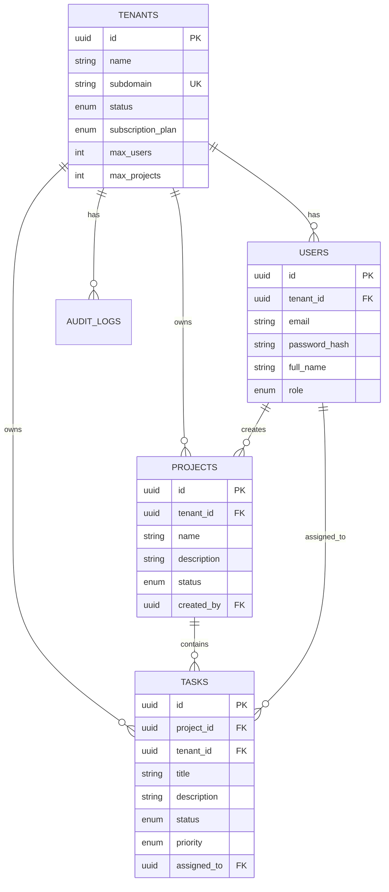

# System Architecture Design

## System Architecture Diagram

```mermaid
graph TD
    Client[Browser (React App)] -->|HTTPS/JSON| LoadBalancer[Docker Host / Nginx]
    LoadBalancer -->|Port 3000| Frontend[Frontend Container]
    LoadBalancer -->|Port 5000| Backend[Backend Container (Node/Express)]
    Backend -->|SQL| DB[Database Container (PostgreSQL 15)]
    
    subgraph "Docker Network"
    Frontend
    Backend
    DB
    end
```

## Database Schema Design (ERD)



## API Architecture

### Auth Module
- `POST /api/auth/register-tenant` (Public)
- `POST /api/auth/login` (Public)
- `GET /api/auth/me` (Auth)
- `POST /api/auth/logout` (Auth)

### Tenant Module
- `GET /api/tenants/:id` (Tenant Admin/Super Admin)
- `PUT /api/tenants/:id` (Tenant Admin/Super Admin)
- `GET /api/tenants` (Super Admin)

### Users Module
- `GET /api/tenants/:id/users` (Auth)
- `POST /api/tenants/:id/users` (Tenant Admin)
- `PUT /api/users/:id` (Tenant Admin/Self)
- `DELETE /api/users/:id` (Tenant Admin)

### Projects Module
- `POST /api/projects` (Auth)
- `GET /api/projects` (Auth)
- `PUT /api/projects/:id` (Tenant Admin/Creator)
- `DELETE /api/projects/:id` (Tenant Admin/Creator)

### Tasks Module
- `POST /api/projects/:projectId/tasks` (Auth)
- `GET /api/projects/:projectId/tasks` (Auth)
- `PATCH /api/tasks/:taskId/status` (Auth)
- `PUT /api/tasks/:taskId` (Auth)